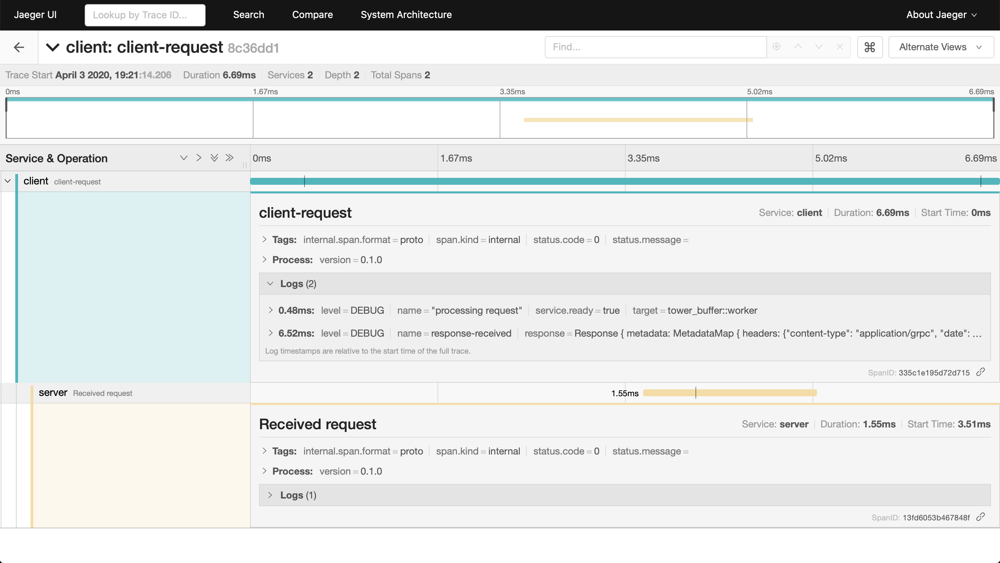

# Tonic example

Example showing [Tonic] client and server interaction with [tracing]
instrumentation and [OpenTelemetry] context propagation.

[Tonic]: https://github.com/hyperium/tonic
[tracing]: https://tracing.rs/
[OpenTelemetry]: https://github.com/open-telemetry/opentelemetry-rust

Examples
--------

```shell
# Run jaeger in background
$ docker run -d -p6831:6831/udp -p6832:6832/udp -p16686:16686 jaegertracing/all-in-one:latest

# Run the server
$ RUST_LOG=trace cargo run --bin helloworld-server 

# Now run the client to make a request to the server
$ RUST_LOG=trace cargo run --bin helloworld-client

# View spans (see the image below)
$ firefox http://localhost:16686/
```

